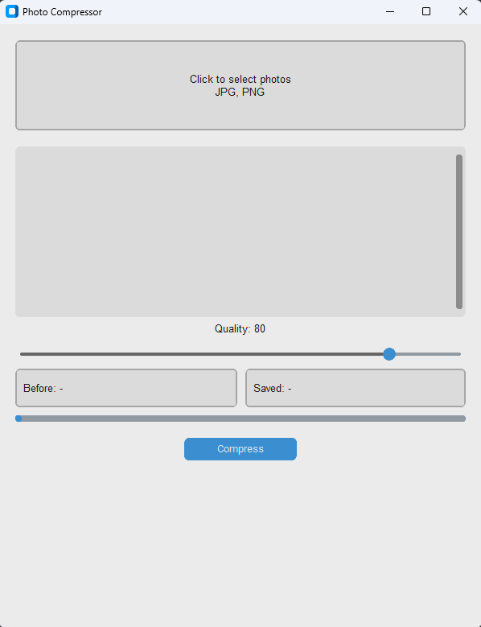
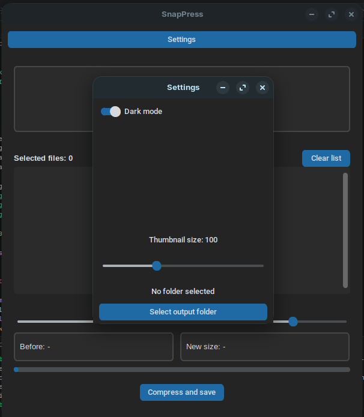
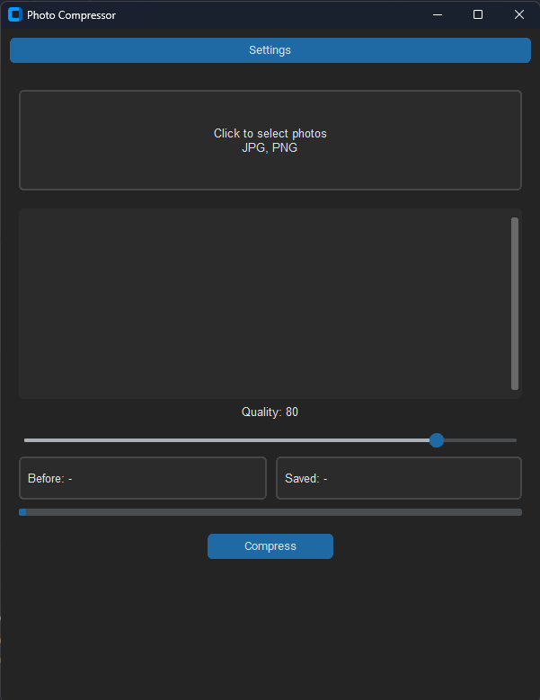
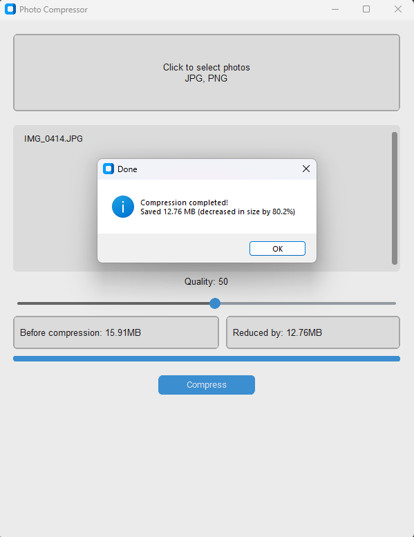
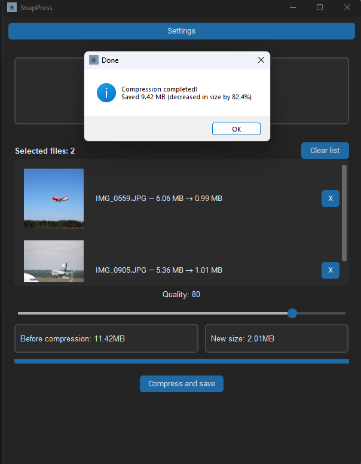

# SnapPress

A desktop application for compressing JPEG and PNG photos without visible quality loss. Built with Python and customtkinter.

  

## Features

- Drag & drop support (not yet)
- Batch compression (multiple files at once)
- Adjustable quality slider (1–95%)
- Progress bar with live feedback
- Savings summary (before / after)
- Saves compressed files next to originals — originals are never overwritten
- Settings menu with custom output folder and adjustable thumbnail size

## Screenshots







## Requirements

- Python 3.10+
- Pillow

## Installation

### Universal (Windows, macOS, Linux)
1. Clone the repository:
```bash
git clone https://github.com/Sebian12/photo-compressor.git
cd photo-compressor
```

2. Install dependencies:
```bash
pip install Pillow
```

3. Run the app:
```bash
python main.py
```

### Windows only

1. Download .exe file from current release


## Linux only (native binary)

1. Download the Linux binary from current release
2. Make it executable `chmod +x SnapPress`
3. Run: `./SnapPress`


## Native Linux Support

A native Linux binary is available starting from v1.8.1. It was built and tested on Zorin OS 18.1 GNOME (Ubuntu-based), v1.8.4 built and tested on Fedora Linux 44 KDE.

Since v1.9.0, every release comes with an .exe file for Windows (oldest tested Windows version is Windows 7), a binary for Ubuntu-based systems, and a binary for Fedora-based systems.

**Note:** the binary may not run on distributions with an older glibc version or on minimal/non-glibc systems (e.g. Alpine). It may also have issues on pure Wayland sessions without XWayland.

If the binary doesn't work on your system, you can run from source:
```bash
pip install customtkinter Pillow
python3 main.py
```

## Usage

1. Click **Choose photos** to select files
2. Adjust the quality slider (default: 80%)
3. Click **Compress and save**
4. Compressed files are saved in the same folder as the originals with a `_compressed` suffix or saved in selected folder

## Roadmap

- [x] Switch from tkinter to customtkinter
- [x] Dark mode (1.2.0)
- [x] Settings menu (1.3.0)
- [x] Custom output folder (1.4.0)
- [x] Settings saver (1.5.0)
- [x] File counter (1.5.0)
- [x] Button to clear photo list or single photo (1.5.0)
- [x] Compressed file size next to file name (1.6.0)
- [x] Thumbnails of photos (1.7.0)
- [x] App logo (1.7.1)
- [x] User set thumbnail size (1.7.2)
- [x] Optimization (1.8.0)
- [ ] EXIF metadata preservation (1.9.0)
- [ ] Granular metadata control in settings (sliders/checkboxes to choose which EXIF tags to keep) (1.10.0)
- [ ] Drag & Drop support (1.11.0)
- [ ] Multithreading (1.12.0)
- [ ] New file format support (1.13.0)
- [ ] Pack compressed photos to zip (1.14.0)
- [ ] Android port (2.0.0)

## Tech stack

- Python 3.14
- customtkinter — GUI
- Pillow — image processing

## License

MIT
